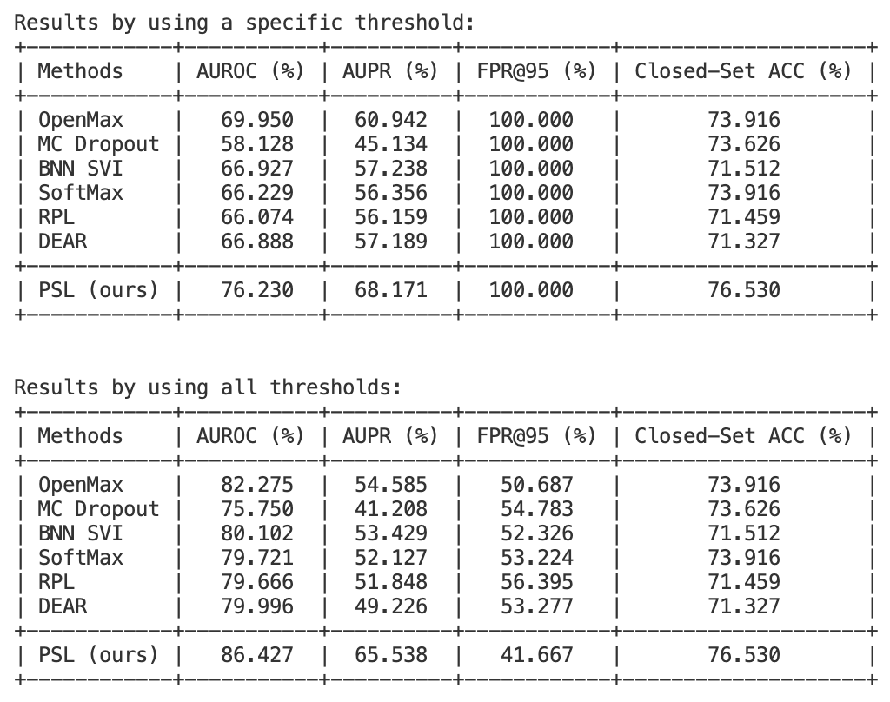
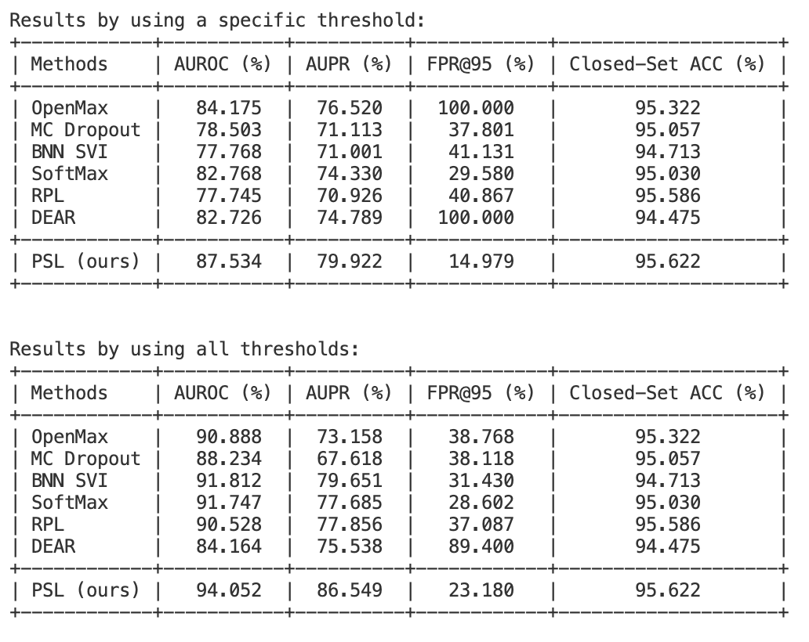
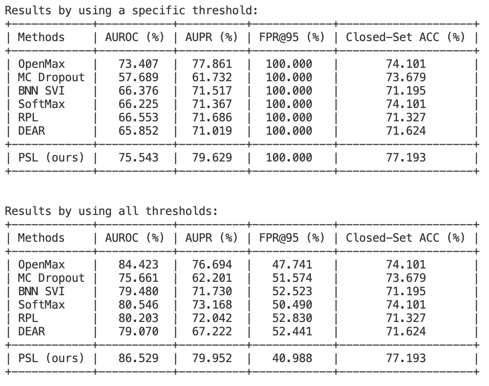
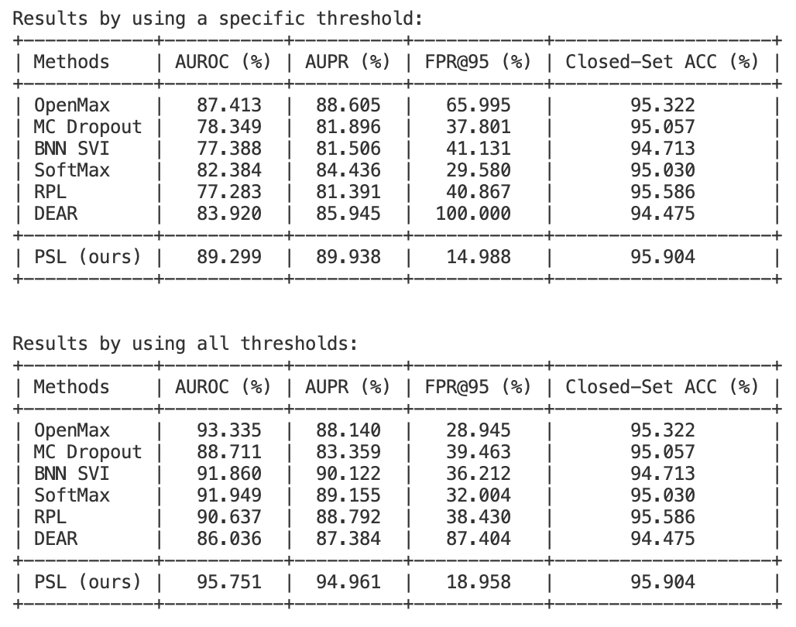

# PSL (Prototypical Similarity Learning)

## Introduction
We provide the uncertainty score .npz files of all methods in Table 1 in this codebase, as well as the evaluation code. Simply follow the guideline below and you can get the result in your terminal in less than 1 second. This codebase is originally provided by the baseline [1], and then we modify the corresponding evaluation protocols, including removing overlapping classes between OoD and InD datasets, using all thresholds to calculate AUROC and AUPR, and evaluation 10 times on MiT-v2 dataset, please see the Appendix A and B for details. We provide the results of TSM for example.

[1] Wentao Bao, Qi Yu, and Yu Kong. Evidential deep learning for open set action recognition. In ICCV, 2021.

## Evaluation on HMDB51 (OoD)
We use TSM backbone as an example to illustrate how to get Table 1 in the paper.
### Open-set results of training from scratch
```shell
cd ./experiments/tsm
./run_openness_new_hmdb_scratch.sh HMDB
```
You should obtain these two tables:

<div  align="center">    

</div>

The first table only uses one specific threshold which is used in [1]. We discuss with the authors in [1] and make an agreement with them to use all thresholds to calculate AUROC and AUPR, and the result is in the second table. We use the second table in our paper.

### Open-set results of training from K400 pretrained model
```shell
cd ./experiments/tsm
./run_openness_new_hmdb.sh HMDB
```
You should obtain these two tables:

<div  align="center">    

</div>

## Evaluation on MiT-v2 (OoD)
We use TSM backbone as an example to illustrate how to get Table 2 in the paper.
### Open-set results of training from scratch
```shell
cd ./experiments/tsm
./run_openness_new_mit_scratch.sh MiT
```
You should obtain these two tables:

<div  align="center">    

</div>

### Open-set results of training from K400 pretrained model
```shell
cd ./experiments/tsm
./run_openness_new_mit.sh MiT
```
You should obtain these two tables:

<div  align="center">    

</div>
